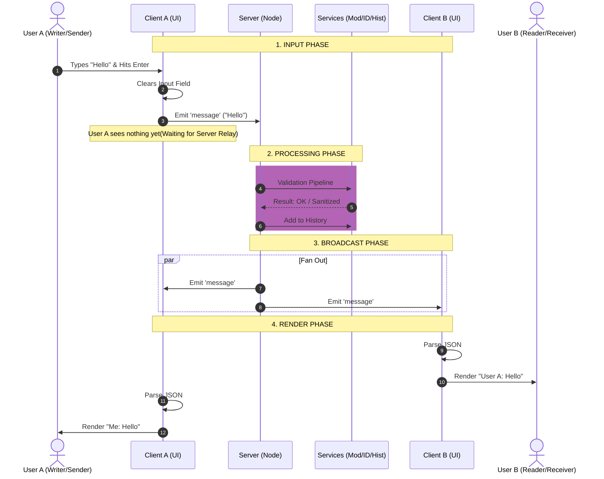

### Mermaid Charts

##### Sender/Receiver flow

```mermaid
sequenceDiagram
    autonumber
    actor Sender as User A (Writer/Sender)
    participant ClientA as Client A (UI)
    participant Server as Server (Node)
    participant Services as Services (Mod/ID/Hist)
    participant ClientB as Client B (UI)
    actor Receiver as User B (Reader/Receiver)

    Note over ClientA, ClientB: 1. INPUT PHASE
    Sender->>ClientA: Types "Hello" & Hits Enter
    ClientA->>ClientA: Clears Input Field
    ClientA->>Server: Emit 'message' ("Hello")
    
    Note over ClientA: User A sees nothing yet(Waiting for Server Relay)

    Note over Server, Services: 2. PROCESSING PHASE
    rect rgb(180, 100, 180)
        Server->>Services: Validation Pipeline
        Services-->>Server: Result: OK / Sanitized
        Server->>Services: Add to History
    end

    Note over Server, ClientB: 3. BROADCAST PHASE
    par Fan Out
        Server->>ClientA: Emit 'message' 
        Server->>ClientB: Emit 'message' 
    end

    Note over ClientA, ClientB: 4. RENDER PHASE
    ClientB->>ClientB: Parse JSON
    ClientB->>Receiver: Render "User A: Hello"
    
    ClientA->>ClientA: Parse JSON
    ClientA->>Sender: Render "Me: Hello"
```

