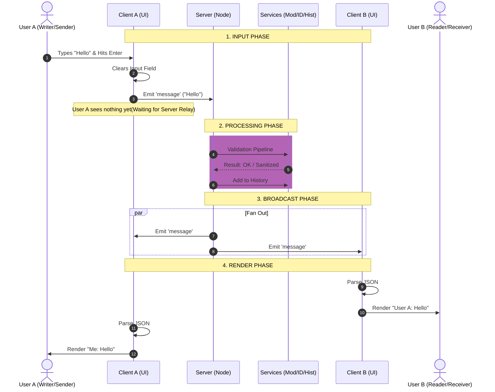
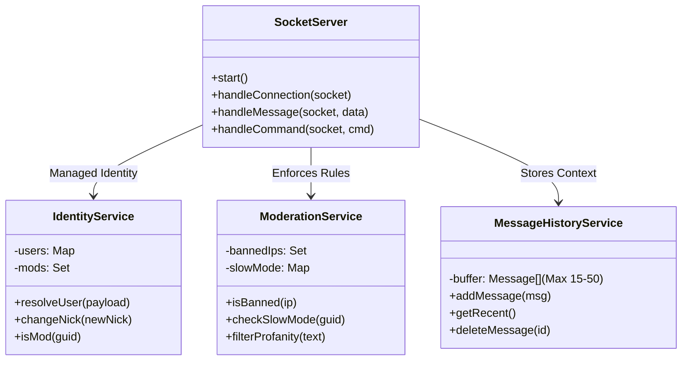
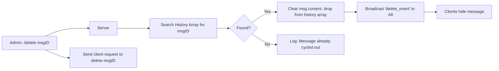
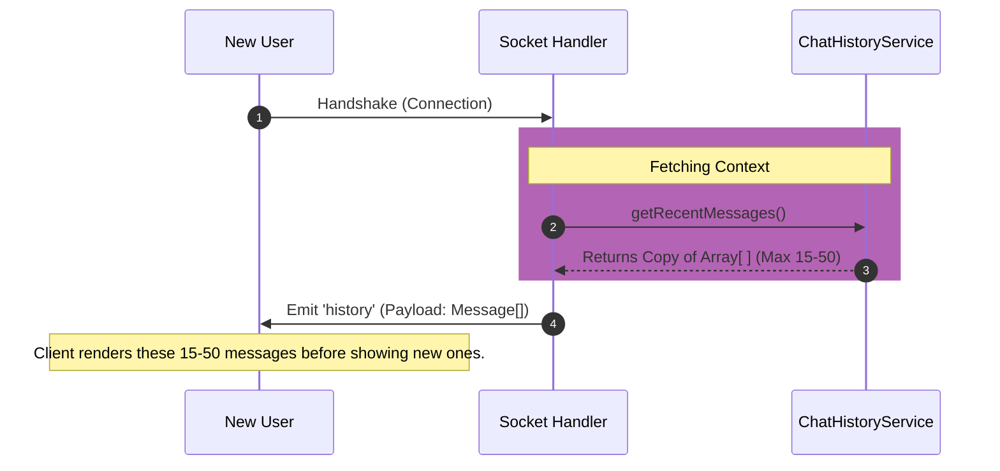
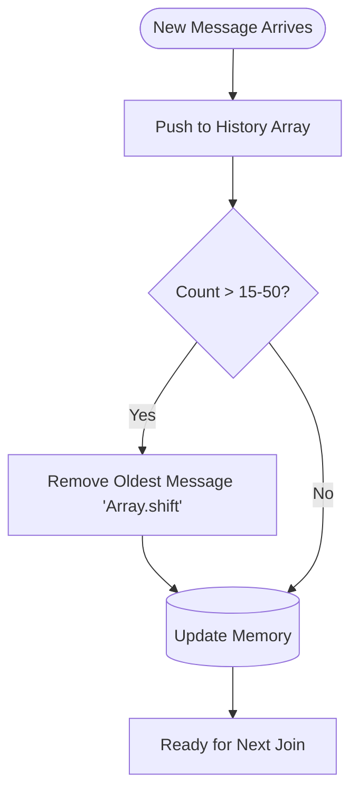
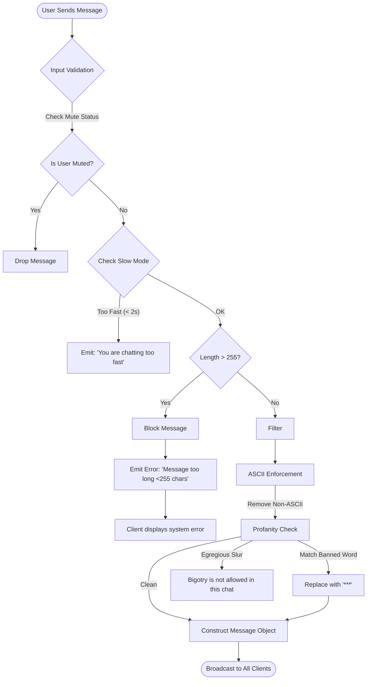
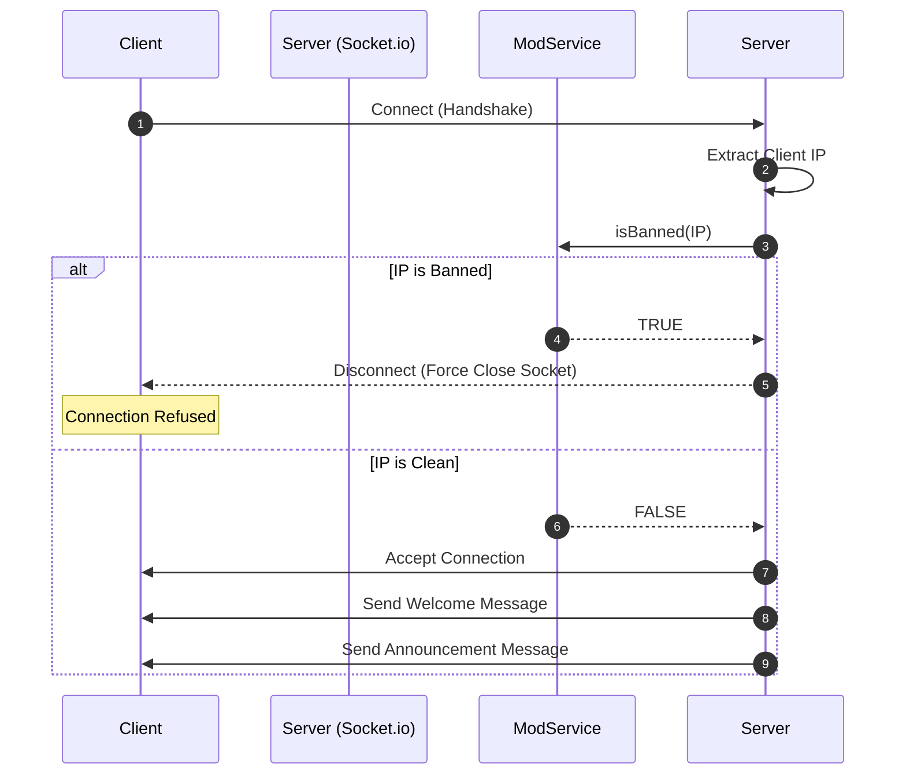
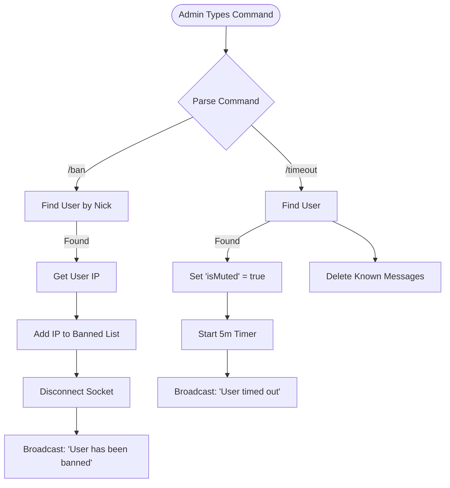
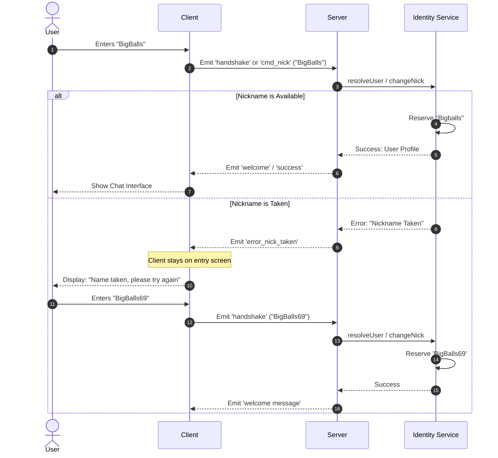
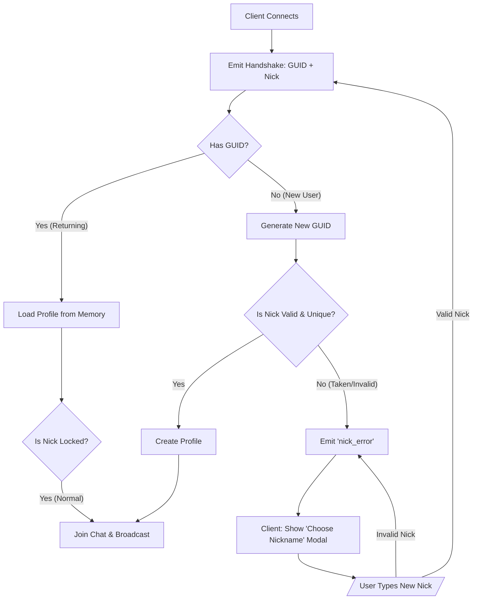

### Mermaid Charts

##### Sender/Receiver flow

##### App UML

##### Delete Message Flow

##### Chat History Flow

##### Chat History Service

##### Message Flow

##### Connection Sequence

##### Admin Commands

##### Nick/Chrat Command

##### Identity Flow

